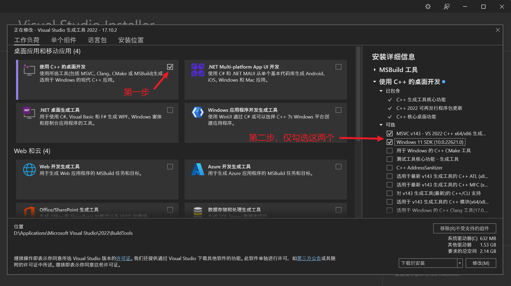
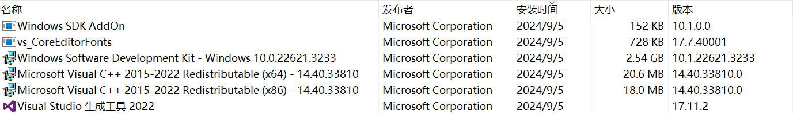

## 构建 Spring Boot 原生应用程序的两种主要方法

1. 使用 Spring Boot 对 Cloud Native Buildpacks 的支持来生成包含本机可执行文件的轻量级容器。
2. 使用 GraalVM 本机构建工具生成本机可执行文件。

## 主要区别

1. 环境依赖不同

   方法 1 需要安装 Docker（安装构建环境的对应版本）

   方法 2 需要安装 Visual Studio Build Tools 和 Windows SDK(无需安装臃肿的 Visual Studio，仅需用到单个组件：MSVC 和
   Windows SDK)
2. 执行的 maven 命令不同

   方法1是`mvn spring-boot:build-image`

   方法2是`mvn -Pnative native:compile`

## 先决条件

1. 安装 graalvm-jdk（环境变量需设置 JAVA_HOME、GRAALVM_HOME）
2. 确保安装了 native-image，graalvm 21 默认已安装，若低版本没有则需要安装：`gu.cmd install native-image`，将从 GitHub 下载（gu
   是 Graalvm 提供的工具，位于 graalvm-jdk/bin 下。小心和 powershell 的 gu 冲突）

## 补充

方法一的 Docker 下载地址：https://docs.docker.com/get-docker/

方法二的 Visual Studio Build Tools 下载地址：https://visualstudio.microsoft.com/zh-hans/visual-cpp-build-tools/

下载好的文件名为：vs_BuildTools.exe，打开后勾选如下

语言包一定选英语！！不然会报下面的错误

> [1/8] Initializing...                                                                                    (0.0s @
> 0.19GB)
 Error: Native-image building on Windows currently only supports target architecture: AMD64 (?? unsupported)
 Error: To prevent native-toolchain checking provide command-line option -H:-CheckToolchain

执行 `mvn -Pnative native:compile` 若报以下错
> Error: Failed to find 'vcvarsall.bat' in a Visual Studio installation.
> Please make sure that Visual Studio 2022 version 17.1.0 or later is installed on your system. You can download it
> at https://visualstudio.microsoft.com/downloads/. If this error persists, please try and run GraalVM Native Image in an
> x64 Native Tools Command Prompt or file a ticket.

则说明修改了安装路径，默认安装在 `C:\Program Files (x86)\Microsoft Visual Studio\2022\BuildTools`，**因此不建议修改安装路径
**

安装成功后，控制面板程序新增如下：

卸载：https://learn.microsoft.com/zh-cn/visualstudio/install/uninstall-visual-studio?view=vs-2022

Spring Native 官方文档：https://docs.spring.io/spring-boot/reference/native-image/developing-your-first-application.html
